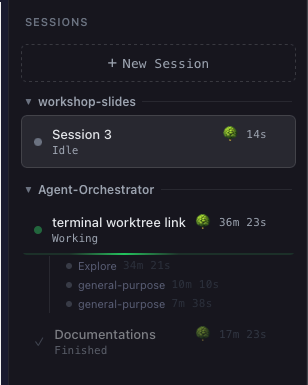
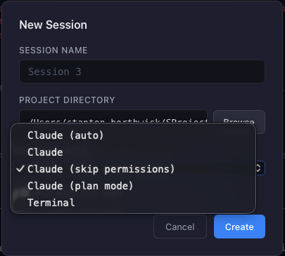
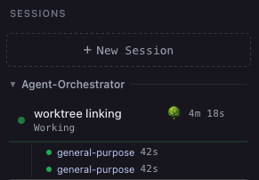
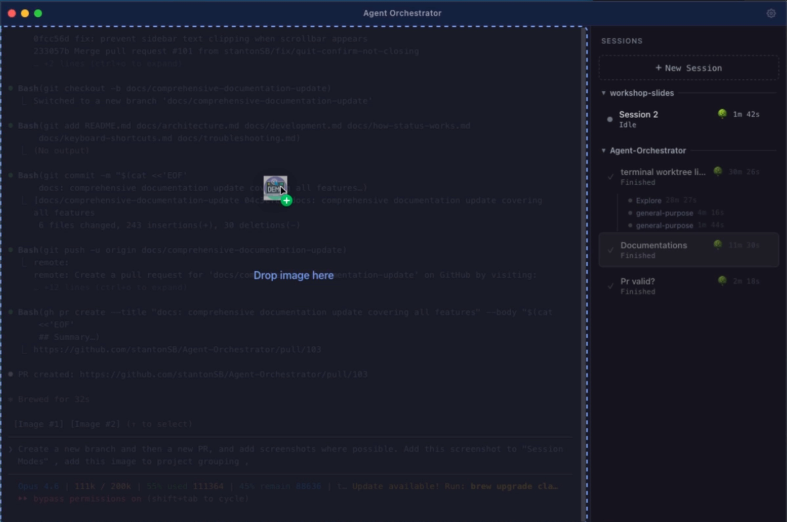
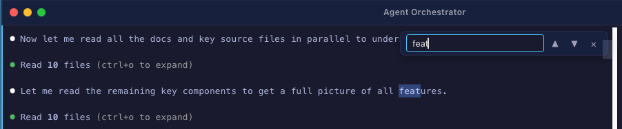
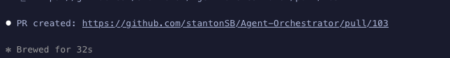
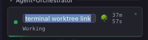
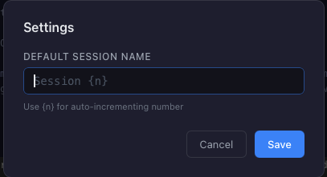

# Agent Orchestrator

Run multiple [Claude Code](https://docs.anthropic.com/en/docs/claude-code) sessions in parallel. Monitor status. Switch instantly. One window.


---


---

## Features

<table>
<tr>
<td width="50%" valign="top">

### Parallel Sessions

Run 5+ Claude Code agents simultaneously, each in its own PTY with full terminal emulation. 256-color support, 10k-line scrollback, and instant switching without losing context.


</td>
<td width="50%" valign="top">

### Real-Time Status

Hook-driven detection shows Working, Idle, Needs Attention, Finished, and Error for each session. No output parsing — status updates come directly from Claude Code's hook system.


</td>
</tr>
<tr>
<td width="50%" valign="top">

### Project Grouping

Sessions are automatically grouped by working directory in a collapsible sidebar. See all your active projects at a glance.



</td>
<td width="50%" valign="top">

### Worktree Isolation

Each session runs `claude --worktree` by default (for git repos), giving it an isolated git branch. Multiple agents can work on the same repo without conflicts.

</td>
</tr>
<tr>
<td width="50%" valign="top">

### Session Modes

Choose how each session runs: **Claude** (default interactive), **Auto** (autonomous mode), **Skip permissions**, **Plan mode**, or **Terminal** (plain shell). Mode selection is remembered between sessions.



</td>
<td width="50%" valign="top">

### Subagent Tracking

When Claude Code dispatches parallel subagents, each one appears with its own status dot and duration timer. See at a glance which subagents are working, finished, or need attention.



</td>
</tr>
<tr>
<td width="50%" valign="top">

### Session Persistence

Finished sessions are automatically saved with their scrollback history. Relaunch the app and pick up where you left off — review past session output anytime.

</td>
<td width="50%" valign="top">

### Image Drag & Drop

Drag images from Finder or a browser directly onto the terminal. The file path is typed into the session automatically — perfect for sharing screenshots with Claude.



</td>
</tr>
<tr>
<td width="50%" valign="top">

### Terminal Search

Press `Cmd+F` to search within any terminal's scrollback. Navigate matches with Enter/Shift+Enter. Full incremental search across the 10k-line buffer.



</td>
<td width="50%" valign="top">

### Clickable File Paths

File paths in terminal output are clickable — `Cmd+click` any path to open it in VS Code at the correct line and column. Supports relative and absolute paths.



</td>
</tr>
<tr>
<td width="50%" valign="top">

### Pull Latest from Main

Optionally pull the latest changes from the default branch before starting a session. Automatically detects the remote's default branch (main, master, etc.) and checks out + pulls.

</td>
<td width="50%" valign="top">

### Keyboard-Driven Workflow

Full keyboard navigation: `Cmd+T` new session, `Cmd+W` close, `Cmd+1-9` switch by position, `Cmd+Shift+[/]` cycle sessions, `Cmd+,` settings, `Cmd+F` search. See [Keyboard Shortcuts](docs/keyboard-shortcuts.md).

</td>
</tr>
<tr>
<td width="50%" valign="top">

### Session Management

Rename sessions (double-click or context menu), close with confirmation dialogs, dismiss finished sessions, and resize the sidebar by dragging. Duration timers track how long each session has been running.



</td>
<td width="50%" valign="top">

### Settings

Configure the default session naming pattern with `{n}` for auto-incrementing numbers. Access via `Cmd+,` or the title bar settings button.



</td>
</tr>
</table>

---

## Install

### Homebrew (Recommended)

```bash
brew tap stantonSB/agent-orchestrator
brew install --cask agent-orchestrator
```

### Manual Download

1. Download the latest `.dmg` from [**Releases**](https://github.com/stantonSB/Agent-Orchestrator/releases)
2. Drag to Applications, then run:
   ```bash
   xattr -dr com.apple.quarantine /Applications/Agent\ Orchestrator.app
   ```
3. Open Agent Orchestrator

> See [Installation Guide](docs/installation.md) for details on prerequisites and first launch.

---

## Quick Start

Open the app → `Cmd+T` → type your prompt → go.

<video src="https://github.com/stantonSB/Agent-Orchestrator/raw/main/assets/quick-start.mp4" controls autoplay muted loop></video>

---

## Documentation

| | Document | Description |
|-|----------|-------------|
| 📦 | [Installation](docs/installation.md) | Download, Gatekeeper bypass, prerequisites, first launch |
| 🏗️ | [Architecture](docs/architecture.md) | System design, component deep-dives, data flow |
| 🛠️ | [Development](docs/development.md) | Setup, build, test, release, IDE configuration |
| 🔔 | [How Status Works](docs/how-status-works.md) | Hook protocol, state machine, event flow |
| ⌨️ | [Keyboard Shortcuts](docs/keyboard-shortcuts.md) | All shortcuts and navigation |
| 🔧 | [Troubleshooting](docs/troubleshooting.md) | Common issues and fixes |
