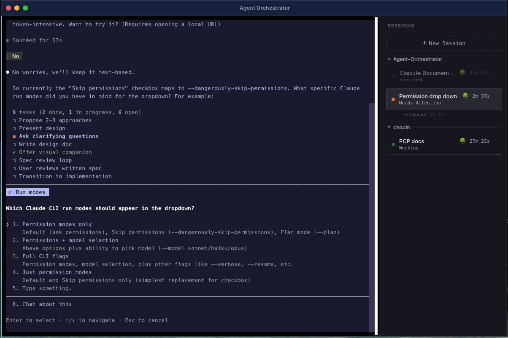
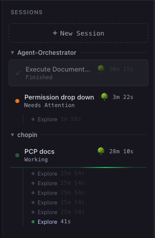
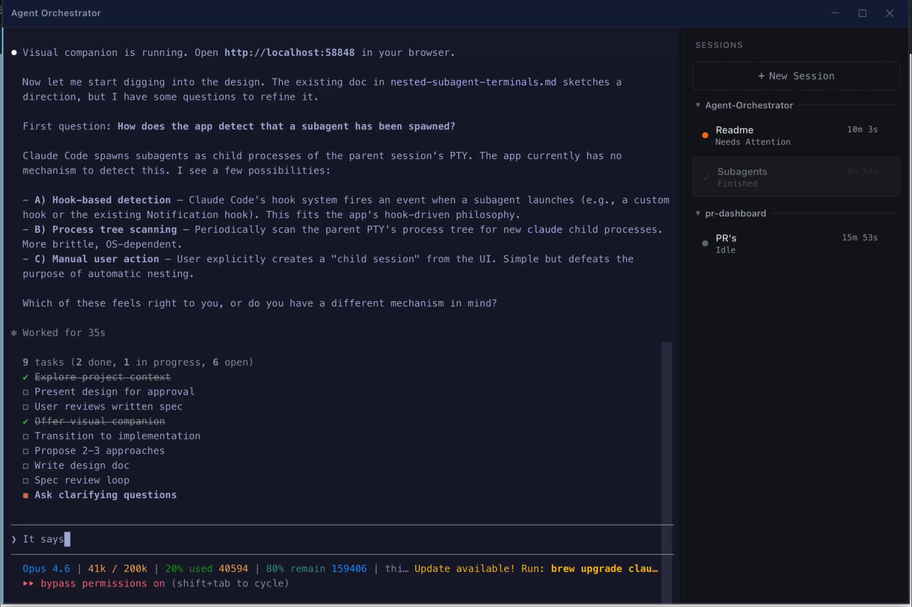

# Agent Orchestrator

Run multiple [Claude Code](https://docs.anthropic.com/en/docs/claude-code) sessions in parallel. Monitor status. Switch instantly. One window.


---



---

## Features

<table>
<tr>
<td width="50%" valign="top">

### Parallel Sessions

Run 5+ Claude Code agents simultaneously, each in its own PTY with full terminal emulation. 256-color support, 10k-line scrollback, and instant switching without losing context.



</td>
<td width="50%" valign="top">

### Real-Time Status

Hook-driven detection shows Working, Idle, Needs Attention, Finished, and Error for each session. No output parsing — status updates come directly from Claude Code's hook system.



</td>
</tr>
<tr>
<td width="50%" valign="top">

### Project Grouping

Sessions are automatically grouped by working directory in a collapsible sidebar. See all your active projects at a glance.


</td>
<td width="50%" valign="top">

### Worktree Isolation

Each session runs `claude --worktree` by default, giving it an isolated git branch. Multiple agents can work on the same repo without conflicts.

</td>
</tr>
</table>

---

## Install

1. Download the latest `.dmg` from [**Releases**](https://github.com/stantonSB/Agent-Orchestrator/releases)
2. Drag to Applications, then run:
   ```bash
   xattr -dr com.apple.quarantine /Applications/Agent\ Orchestrator.app
   ```
3. Open Agent Orchestrator

> See [Installation Guide](docs/installation.md) for details on Gatekeeper, first launch, and prerequisites.

---

## Quick Start

Open the app → `Cmd+T` → type your prompt → go.

<video src="https://github.com/stantonSB/Agent-Orchestrator/raw/main/assets/quick-start.mp4" controls autoplay muted loop></video>

---

## Documentation

| | Document | Description |
|-|----------|-------------|
| 📦 | [Installation](docs/installation.md) | Download, Gatekeeper bypass, prerequisites, first launch |
| 🏗️ | [Architecture](docs/architecture.md) | System design, component deep-dives, data flow |
| 🛠️ | [Development](docs/development.md) | Setup, build, test, release, IDE configuration |
| 🔔 | [How Status Works](docs/how-status-works.md) | Hook protocol, state machine, event flow |
| ⌨️ | [Keyboard Shortcuts](docs/keyboard-shortcuts.md) | All shortcuts and navigation |
| 🔧 | [Troubleshooting](docs/troubleshooting.md) | Common issues and fixes |
